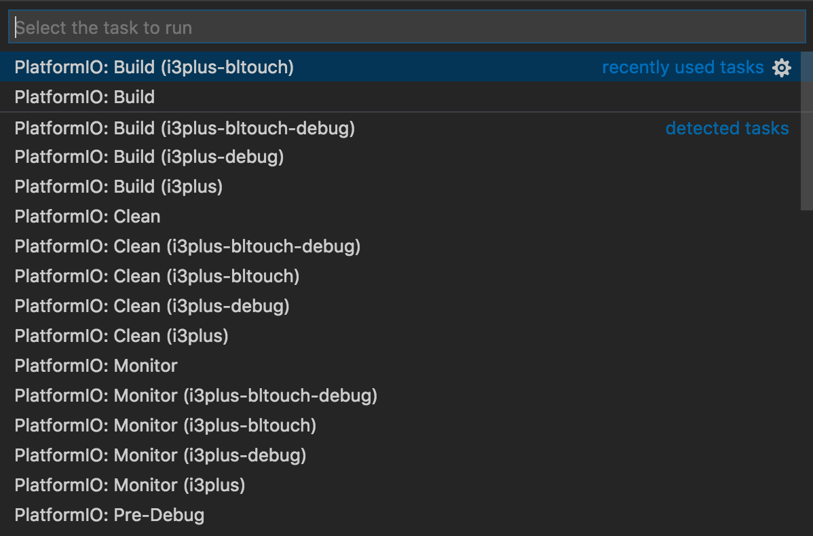
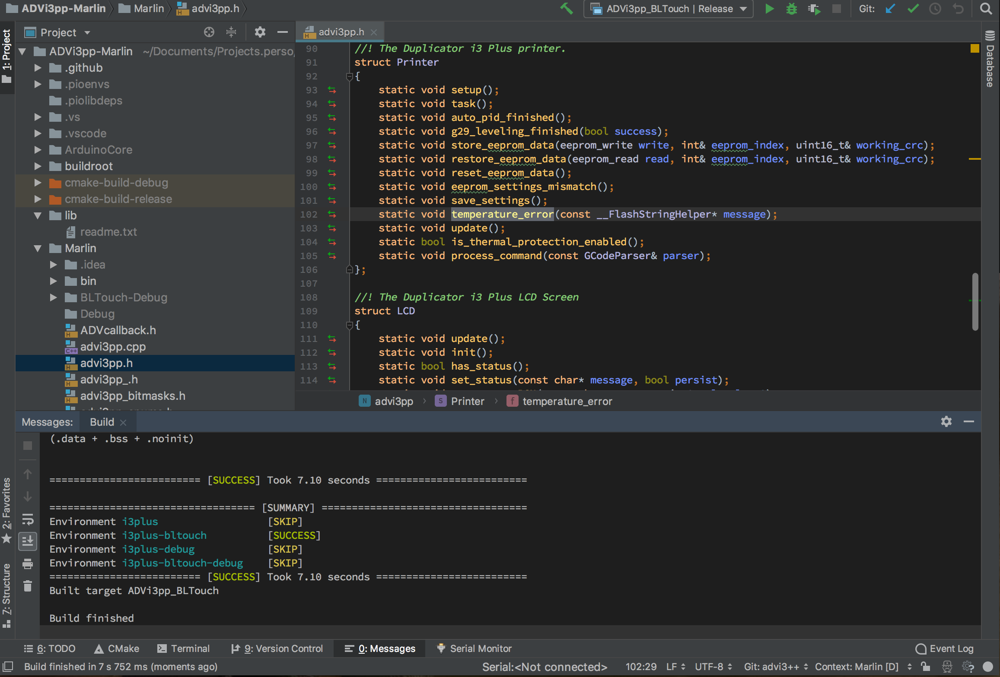

# Building ADVi3++ from the Sources

**Note**: Work in progress.

## Introduction

The sources of **ADVi3++** are hosted on GitHub in two projects:

* [ADVi3pp-Marlin](https://github.com/andrivet/ADVi3pp-Marlin) for the Mainboard part
* [ADVi3pp-LCD](https://github.com/andrivet/ADVi3pp-LCD) for the LCD Touch Panel part

Here, we will only consider the Mainboard part, based on [Marlin Firmware](http://marlinfw.org).

There are several ways to build **ADVi3++** from the sources:

* Using [Visual Studio Code](https://code.visualstudio.com) ([PlatformIO IDE](https://platformio.org/platformio-ide)). **This is the recommended way**.
* Using [Jetbrains CLion](https://www.jetbrains.com/clion/) and [PlatformIO](http://docs.platformio.org/en/latest/ide/clion.html). This is what I am using the most
* Using [Atmel Studio 7](https://www.microchip.com/mplab/avr-support/atmel-studio-7) (based on Microsoft Visual Studio 2015)
* Using [Arduino IDE](https://www.arduino.cc/en/Main/Software). This what people are using the most often but **I recommend to avoid this solution**. **ADVi3++** may drop support for Arduino IDE in the future (more on this later)
* Using any other editor or IDE (Atom, Sublime, ...) and [PlatformIO Core](https://platformio.org)

The following chapters describe each solution.

## Download ADVi3++ Sources


The first step is to obtain the sources. They are hosted on GitHub. You have several way to do that:

* On the [GitHub page](https://github.com/andrivet/ADVi3pp-Marlin), choose **Clone or Download** and then the best option for you
* Use your local installation of **Git** to clone the project:

```
git clone https://github.com/andrivet/ADVi3pp-Marlin.git
```

* Fork the project in GitHub and then clone your fork locally. If you plan to made modifications and submit Push Requests, this is the way to go.

## Visual Studio Code / PlatformIO IDE


**Note**: **This is the recommended way to build ADVi3++**.

Visual Studio Code (not the same than Visual Studio) is a free, open-source and multi-platform IDE created by Microsoft. This is today one of the best free IDE with many extensions to support different languages, framework, etc. One of these extensions is PlatformIO IDE.

[The installation is simple](https://platformio.org/get-started/ide?install=vscode). You first install Visual Studio Code and then the `platformio-ide` extension.

Then follow these steps:

* Start Visual Studio Code
* Click on **PlatformIO Home** button on the bottom [PlatformIO Toolbar](http://docs.platformio.org/en/latest/ide/vscode.html#ide-vscode-toolbar)


* Under **Quick Access**, click on **Open Project** (not **Import**)
* Navigate to the root of the **ADVi3pp-Marlin** project. This directory contains a file named **platformio.ini**. Click **Open [directory name]**.
* The project is loaded, parsed and the PlatformIO Toolbar turns blue.
* To build the project with default settings, click on the checkmark in the bottom PlatformIO toolbar


* The project is build and you see something similar to this:

```
[...]
AVR Memory Usage
----------------
Device: atmega2560

Program:  153632 bytes (58.6% Full)
(.text + .data + .bootloader)

Data:       5417 bytes (66.1% Full)
(.data + .bss + .noinit)


========================================================================= [SUCCESS] Took 7.30 seconds =========================================================================

================================================================================== [SUMMARY] ==================================================================================
Environment i3plus                      [SUCCESS]
Environment i3plus-bltouch              [SUCCESS]
Environment i3plus-debug                [SKIP]
Environment i3plus-bltouch-debug        [SKIP]
========================================================================= [SUCCESS] Took 14.11 seconds =========================================================================
```

* As you can see, by default, it builds the `i3plus` and `i3plus-bltouch` targets, i.e. the release version for the stock i3 Plus printer and the release version for the printer with a BLTouch sensor.
* To build other targets, click on the **Run Task...** icon


* Choose the appropriate task:



* Firmwares are built into the hidden `.pioenvs` folder in sub-folders with the names of the targets. The name of the firmware is always `firmware.elf` (binary executable) and `firmware.hex` (hexadecimal text form).

## Jetbrains CLion



[CLion](https://www.jetbrains.com/clion/) is a **commercial** IDE created by [Jetbrains](https://www.jetbrains.com). If you are already the owner of CLion or of Jetbrains suite of IDE, it is an interesting option, in particular if you are familiar with the other IDEs such as WebStorm (Javascript), IDEA (Java), PyCharm (Python), etc.

**TO WRITE**

## Atmel Studio 7

**TO WRITE**

## Arduino IDE


Even if it is often the solution chosen by people, **I recommend to avoid it** for the following reasons:

* Is Arduino IDE still actively developed? It is not sure at all if you look at the history of releases and news on the blog. Maybe the plan is to replace it entirely by Arduino Create, the cloud version of Arduino IDE.
* The Arduino IDE is far behind alternatives such as Visual Studio Code regarding the IDE and the editor. 
* Even with the Beta 1.9, it is still not possible to put source code in subfolders. The toolchain does support subfolders but not the IDE. In other terms, it is possible to compile but not to edit.
* Arduino IDE is good to do some sketches, not to cope with relatively big project as Marlin and ADVi3++ are.
* With Arduino IDE, it is difficult to build for either the stock firmware or for BLTouch support. There is nothing to support multiple targets.
* Because of all these reasons, **I may drop in the near future the support of Arduino IDE**.

However, if you still want to use Arduino IDE, here are the steps:

* Open Arduino IDE (1.8.5 or higher)
* Select **File** | **Open** and browse to `Marlin.ino` inside the `Marlin` subfolder
* Select the right board under **Tools**:
  - **Board**: Arduino/Genuino Mega or Mega2560
  - **Processor**: ATmega2560 (Mega 2560)
* Click on the rounded checkmark to build the project or select **Verify/Compile** in the **Sketch** menu
* You can them **Upload** the firmware onto the printer (be sure to select the right port before under **Tools**)
* Or **Export compile binary**. It generates the following files (in the `Marlin` subdirectory):
    - `Marlin.ino.mega.hex`
    - `Marlin.ino.with_bootloader.mega.hex`

* Usually, you use the first file (`Marlin.ino.mega.hex`)

### Build a BLTouch release with Arduino IDE

By default, **ADVI3++** build a non-BLTouch release (i.e. a release for the stock printer). If you want to build a BLTouch release, I highly encourage you to use **PlatformIO** or **PlatformIO IDE**. However, I have recently modified the sources to ease the build with Arduino IDE:

* Download the latest sources: https://github.com/andrivet/ADVi3pp-Marlin/archive/advi3++.zip
* Open the file `advi3pp_defines.h`
* Uncomment the line with `#define ADVi3PP_BLTOUCH` (i.e. remove the two `//` and the space.
* Compile as explain above

**Note**: The current latest release (3.0.1) does not include these changes (i.e. the file `advi3pp_defines.h`) so be sure to use the link above.

## PlatformIO Core

**TO WRITE**


